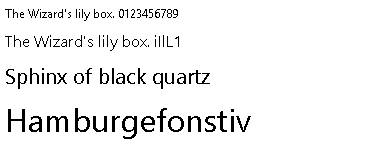
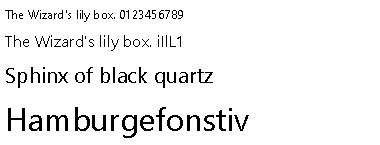
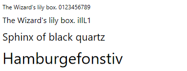
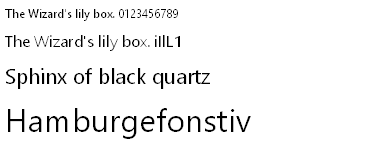
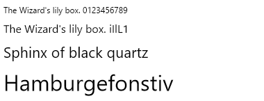
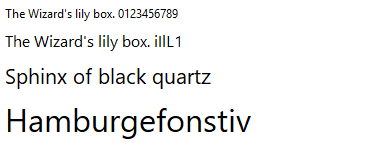
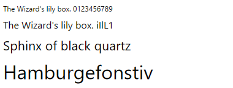
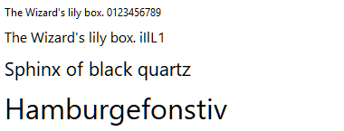
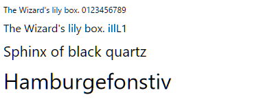
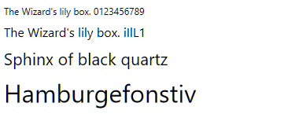

# Windows text rendering: which settings affect which renderer

Measured on 2026-08-10 15:45 by the `BCT_Tests` harness in this repository.

Windows 11 Pro 25H2 (build 26200.8875) · 64-bit test process · displays: DISPLAY1, DISPLAY2, DISPLAY3 · CLR 4.0.30319.42000

## How this was measured

* Each row is measured by clearing **every** Avalon.Graphics value under both hives on every display, setting **one** value, rendering, and comparing the result pixel for pixel against the same render taken with no Avalon.Graphics values present at all.
* Every render happens in a freshly launched process. DirectWrite resolves its default rendering parameters when a factory is created, and real applications pick these settings up at startup, so a new process per configuration is both the safe way to avoid a stale cache and a faithful model of what an application sees.
* The GDI sample is drawn with `CreateFontIndirect` + `TextOut` on a 32-bit DIB, with `DEFAULT_QUALITY` so that GDI consults the system font-smoothing settings rather than being told what to do.
* **The two DirectWrite columns are not the same experiment.** `IDWriteFactory::CreateMonitorRenderingParams` picks up the Avalon.Graphics registry values and `SPI_SETFONTSMOOTHINGORIENTATION` — but **not** `SPI_SETFONTSMOOTHING` (the antialiasing on/off switch) and **not** `SPI_SETFONTSMOOTHINGTYPE` (grayscale versus ClearType). It reports `clearTypeLevel = 1` and `renderingMode = DEFAULT` even with antialiasing switched off system-wide. **DirectWrite (raw defaults)** hands exactly those parameters to `IDWriteBitmapRenderTarget::DrawGlyphRun` and changes nothing, so it antialiases in every mode.
* **DirectWrite (as applications use it)** does what a real client has to do: it keeps DirectWrite's tuning parameters — gamma, enhanced contrast, ClearType level, pixel geometry — but reads the system font-smoothing state itself and picks the rendering mode from it, because DirectWrite will not. Antialiasing off becomes `DWRITE_RENDERING_MODE_ALIASED`; grayscale becomes antialiased with the ClearType level forced to 0. This is the same policy this repository's own `DirectWriteSampleRenderer` applies, and it is the column that corresponds to what you see in Firefox, WPF and the tuner's own preview.
* That split is the point of the table. A ✅ in the raw-defaults column means DirectWrite itself consumed the value; a ✅ only in the application column means the application had to act on it. It also explains why an Avalon.Graphics value can look dead in the application column while working in the raw column: once the application has committed to aliased or grayscale output, the ClearType tuning it would have fed no longer reaches the glyphs.
* The whole sweep is run once inside each of the 4 system font-smoothing configurations that form the columns, because a setting can matter in one mode and be irrelevant in another.
* Both DirectWrite columns use the `IDWriteBitmapRenderTarget` path. A client drawing through Direct2D or `IDWriteGlyphRunAnalysis` sets its antialias mode through a different API and can differ in detail, though it faces the same split: the mode is the application's decision, the tuning is DirectWrite's.
* A repeat of each baseline render is compared against the original to confirm the renders are reproducible; every repeat came back byte-identical, so any difference reported below is real.
* 184 renders were taken in 2.2 minutes.

## The matrix

Legend: ✅ the setting changes the rendered pixels (with the largest share of pixels it changed) · — byte-identical output · n/t not tested.

| Where | Setting | GDI<br>No antialiasing | GDI<br>Grayscale antialiasing | GDI<br>ClearType (RGB) | GDI<br>ClearType (BGR) | DirectWrite (as applications use it)<br>No antialiasing | DirectWrite (as applications use it)<br>Grayscale antialiasing | DirectWrite (as applications use it)<br>ClearType (RGB) | DirectWrite (as applications use it)<br>ClearType (BGR) | DirectWrite (raw defaults)<br>No antialiasing | DirectWrite (raw defaults)<br>Grayscale antialiasing | DirectWrite (raw defaults)<br>ClearType (RGB) | DirectWrite (raw defaults)<br>ClearType (BGR) |
| --- | --- | :---: | :---: | :---: | :---: | :---: | :---: | :---: | :---: | :---: | :---: | :---: | :---: |
| `HKCU\...\Avalon.Graphics\<display>` | `ClearTypeLevel` | — | — | — | — | — | — | ✅ 9.1% | ✅ 9.1% | ✅ 8.5% | ✅ 8.5% | ✅ 8.5% | ✅ 8.5% |
| `HKCU\...\Avalon.Graphics\<display>` | `GammaLevel` | — | — | — | — | — | ✅ 6.8% | ✅ 9.4% | ✅ 9.4% | ✅ 8.7% | ✅ 8.7% | ✅ 8.7% | ✅ 8.7% |
| `HKCU\...\Avalon.Graphics\<display>` | `PixelStructure` | — | — | — | — | — | — | ✅ 9.1% | ✅ 9.1% | ✅ 8.5% | ✅ 8.5% | ✅ 8.5% | ✅ 8.5% |
| `HKCU\...\Avalon.Graphics\<display>` | `TextContrastLevel` | — | — | — | — | — | — | — | — | — | — | — | — |
| `HKCU\...\Avalon.Graphics\<display>` | `EnhancedContrastLevel` | — | — | — | — | — | ✅ 6.8% | ✅ 9.4% | ✅ 9.4% | ✅ 8.7% | ✅ 8.7% | ✅ 8.7% | ✅ 8.7% |
| `HKCU\...\Avalon.Graphics\<display>` | `GrayscaleEnhancedContrastLevel` | — | — | — | — | — | — | — | — | — | — | — | — |
| `HKLM\...\Avalon.Graphics\<display>` | `ClearTypeLevel` | — | — | — | — | — | — | — | — | — | — | — | — |
| `HKLM\...\Avalon.Graphics\<display>` | `GammaLevel` | — | — | — | — | — | ✅ 6.8% | ✅ 9.4% | ✅ 9.4% | ✅ 8.7% | ✅ 8.7% | ✅ 8.7% | ✅ 8.7% |
| `HKLM\...\Avalon.Graphics\<display>` | `PixelStructure` | — | — | — | — | — | — | ✅ 9.1% | ✅ 9.1% | ✅ 8.5% | ✅ 8.5% | ✅ 8.5% | ✅ 8.5% |
| `HKLM\...\Avalon.Graphics\<display>` | `TextContrastLevel` | — | — | — | — | — | — | — | — | — | — | — | — |
| `HKLM\...\Avalon.Graphics\<display>` | `EnhancedContrastLevel` | — | — | — | — | — | — | — | — | — | — | — | — |
| `HKLM\...\Avalon.Graphics\<display>` | `GrayscaleEnhancedContrastLevel` | — | — | — | — | — | — | — | — | — | — | — | — |
| `HKCU\...\Avalon.Graphics\<display>` | `GrayscaleEnhancedContrastLevel (with ClearTypeLevel = 0)` | — | — | — | — | — | — | — | — | — | — | — | — |
| `SystemParametersInfo` | `FontSmoothingContrast` | — | — | ✅ 7.6% | ✅ 7.6% | — | — | — | — | — | — | — | — |
| `SystemParametersInfo` | `FontSmoothingOrientation` | — | — | ✅ 7.3% | ✅ 7.3% | — | — | ✅ 9% | ✅ 9% | ✅ 8.4% | ✅ 8.4% | ✅ 8.4% | ✅ 8.4% |

## Does the system font-smoothing mode reach each renderer?

The sweep above only ever compares renders taken *within* one column. This table compares the columns against each other, using the baseline render of each base state with no Avalon.Graphics values present at all.

| System font smoothing | GDI | DirectWrite (as applications use it) | DirectWrite (raw defaults) |
| --- | --- | --- | --- |
| Grayscale antialiasing | ✅ 4.5% | ✅ 7.2% | — identical |
| ClearType (RGB) | ✅ 7.7% | ✅ 9.5% | — identical |
| ClearType (BGR) | ✅ 7.7% | ✅ 9.5% | ✅ 8.4% |

## What each setting actually feeds

The DirectWrite column below is read back from `IDWriteRenderingParams` after the value was written, so it names the parameter the value lands in rather than inferring it from the picture.

| Where | Setting | Documented as | DirectWrite parameters it moved | Any effect on rendering |
| --- | --- | --- | --- | --- |
| `HKCU\...\Avalon.Graphics\<display>` | `ClearTypeLevel` | 0-100, default 100. Documented (WPF ClearType Registry Settings). | `clearTypeLevel` | yes |
| `HKCU\...\Avalon.Graphics\<display>` | `GammaLevel` | 1000-2200, default 1900. Documented for HKEY_LOCAL_MACHINE only. | `gamma` | yes |
| `HKCU\...\Avalon.Graphics\<display>` | `PixelStructure` | 0 = Flat, 1 = RGB, 2 = BGR. Documented for HKEY_LOCAL_MACHINE only. | `pixelGeometry` | yes |
| `HKCU\...\Avalon.Graphics\<display>` | `TextContrastLevel` | 0-6, default 1. Documented (WPF ClearType Registry Settings). | none | no |
| `HKCU\...\Avalon.Graphics\<display>` | `EnhancedContrastLevel` | Undocumented; written by cttune.exe. Feeds IDWriteRenderingParams::GetEnhancedContrast. | `enhancedContrast` | yes |
| `HKCU\...\Avalon.Graphics\<display>` | `GrayscaleEnhancedContrastLevel` | Undocumented; written by cttune.exe. Feeds IDWriteRenderingParams1::GetGrayscaleEnhancedContrast. | `grayscaleEnhancedContrast` | no |
| `HKLM\...\Avalon.Graphics\<display>` | `ClearTypeLevel` | 0-100, default 100. Documented for HKEY_CURRENT_USER only. | none | no |
| `HKLM\...\Avalon.Graphics\<display>` | `GammaLevel` | 1000-2200, default 1900. Documented (WPF ClearType Registry Settings). | `gamma` | yes |
| `HKLM\...\Avalon.Graphics\<display>` | `PixelStructure` | 0 = Flat, 1 = RGB, 2 = BGR, default 0. Documented (WPF ClearType Registry Settings). | `pixelGeometry` | yes |
| `HKLM\...\Avalon.Graphics\<display>` | `TextContrastLevel` | 0-6, default 1. Documented for HKEY_CURRENT_USER only. | none | no |
| `HKLM\...\Avalon.Graphics\<display>` | `EnhancedContrastLevel` | Undocumented; cttune.exe writes it to HKEY_CURRENT_USER. | none | no |
| `HKLM\...\Avalon.Graphics\<display>` | `GrayscaleEnhancedContrastLevel` | Undocumented; cttune.exe writes it to HKEY_CURRENT_USER. | none | no |
| `HKCU\...\Avalon.Graphics\<display>` | `GrayscaleEnhancedContrastLevel (with ClearTypeLevel = 0)` | Undocumented; written by cttune.exe. Measured with ClearTypeLevel = 0, which is what puts DirectWrite into grayscale rendering. | `grayscaleEnhancedContrast` | no |
| `SystemParametersInfo` | `FontSmoothingContrast` | 1000-2200. Documented (SystemParametersInfo). | none | yes |
| `SystemParametersInfo` | `FontSmoothingOrientation` | 0 = BGR, 1 = RGB. Documented (SystemParametersInfo). | `pixelGeometry` | yes |

## Baseline renders

With no Avalon.Graphics values present at all, so only the system font-smoothing settings apply.

### No antialiasing

DirectWrite reported gamma 1.8, enhanced contrast 0.5, grayscale enhanced contrast 1, ClearType level 1, pixel geometry RGB, rendering mode DEFAULT.

GDI:



DirectWrite (as applications use it):



DirectWrite (raw defaults):



### Grayscale antialiasing

DirectWrite reported gamma 1.8, enhanced contrast 0.5, grayscale enhanced contrast 1, ClearType level 1, pixel geometry RGB, rendering mode DEFAULT.

GDI:



DirectWrite (as applications use it):



DirectWrite (raw defaults):


### ClearType (RGB)

DirectWrite reported gamma 1.8, enhanced contrast 0.5, grayscale enhanced contrast 1, ClearType level 1, pixel geometry RGB, rendering mode DEFAULT.

GDI:



DirectWrite (as applications use it):



DirectWrite (raw defaults):


### ClearType (BGR)

DirectWrite reported gamma 1.8, enhanced contrast 0.5, grayscale enhanced contrast 1, ClearType level 1, pixel geometry BGR, rendering mode DEFAULT.

GDI:



DirectWrite (as applications use it):



DirectWrite (raw defaults):



## Per-setting detail

### Base state: No antialiasing

#### `ClearTypeLevel` — `HKCU\...\Avalon.Graphics\<display>`

Compared against: value not present.

| Value | GDI vs baseline | DirectWrite (as applications use it) vs baseline | DirectWrite (raw defaults) vs baseline | DirectWrite parameters | Images |
| --- | --- | --- | --- | --- | --- |
| 0 | identical | identical | 4673 px (8.5%), max channel delta 118 | clearTypeLevel 1 -> 0 | [GDI](images/aa-off__hkcu-cleartypelevel__0.gdi.png) · [DW app](images/aa-off__hkcu-cleartypelevel__0.dwapp.png) · [DW raw](images/aa-off__hkcu-cleartypelevel__0.dw.png) |
| 50 | identical | identical | 4667 px (8.5%), max channel delta 78 | clearTypeLevel 1 -> 0.5 | [GDI](images/aa-off__hkcu-cleartypelevel__50.gdi.png) · [DW app](images/aa-off__hkcu-cleartypelevel__50.dwapp.png) · [DW raw](images/aa-off__hkcu-cleartypelevel__50.dw.png) |
| 100 | identical | identical | identical | unchanged | [GDI](images/aa-off__hkcu-cleartypelevel__100.gdi.png) · [DW app](images/aa-off__hkcu-cleartypelevel__100.dwapp.png) · [DW raw](images/aa-off__hkcu-cleartypelevel__100.dw.png) |

#### `GammaLevel` — `HKCU\...\Avalon.Graphics\<display>`

Compared against: value not present.

| Value | GDI vs baseline | DirectWrite (as applications use it) vs baseline | DirectWrite (raw defaults) vs baseline | DirectWrite parameters | Images |
| --- | --- | --- | --- | --- | --- |
| 1000 | identical | identical | 4800 px (8.7%), max channel delta 54 | gamma 1.8 -> 1 | [GDI](images/aa-off__hkcu-gammalevel__1000.gdi.png) · [DW app](images/aa-off__hkcu-gammalevel__1000.dwapp.png) · [DW raw](images/aa-off__hkcu-gammalevel__1000.dw.png) |
| 1600 | identical | identical | 4724 px (8.6%), max channel delta 11 | gamma 1.8 -> 1.6 | [GDI](images/aa-off__hkcu-gammalevel__1600.gdi.png) · [DW app](images/aa-off__hkcu-gammalevel__1600.dwapp.png) · [DW raw](images/aa-off__hkcu-gammalevel__1600.dw.png) |
| 2200 | identical | identical | 4800 px (8.7%), max channel delta 19 | gamma 1.8 -> 2.2 | [GDI](images/aa-off__hkcu-gammalevel__2200.gdi.png) · [DW app](images/aa-off__hkcu-gammalevel__2200.dwapp.png) · [DW raw](images/aa-off__hkcu-gammalevel__2200.dw.png) |

#### `PixelStructure` — `HKCU\...\Avalon.Graphics\<display>`

Compared against: value not present.

| Value | GDI vs baseline | DirectWrite (as applications use it) vs baseline | DirectWrite (raw defaults) vs baseline | DirectWrite parameters | Images |
| --- | --- | --- | --- | --- | --- |
| 0 | identical | identical | 4673 px (8.5%), max channel delta 118 | pixelGeometry RGB -> FLAT | [GDI](images/aa-off__hkcu-pixelstructure__0.gdi.png) · [DW app](images/aa-off__hkcu-pixelstructure__0.dwapp.png) · [DW raw](images/aa-off__hkcu-pixelstructure__0.dw.png) |
| 1 | identical | identical | identical | unchanged | [GDI](images/aa-off__hkcu-pixelstructure__1.gdi.png) · [DW app](images/aa-off__hkcu-pixelstructure__1.dwapp.png) · [DW raw](images/aa-off__hkcu-pixelstructure__1.dw.png) |
| 2 | identical | identical | 4604 px (8.4%), max channel delta 186 | pixelGeometry RGB -> BGR | [GDI](images/aa-off__hkcu-pixelstructure__2.gdi.png) · [DW app](images/aa-off__hkcu-pixelstructure__2.dwapp.png) · [DW raw](images/aa-off__hkcu-pixelstructure__2.dw.png) |

#### `TextContrastLevel` — `HKCU\...\Avalon.Graphics\<display>`

Compared against: value not present.

| Value | GDI vs baseline | DirectWrite (as applications use it) vs baseline | DirectWrite (raw defaults) vs baseline | DirectWrite parameters | Images |
| --- | --- | --- | --- | --- | --- |
| 0 | identical | identical | identical | unchanged | [GDI](images/aa-off__hkcu-textcontrastlevel__0.gdi.png) · [DW app](images/aa-off__hkcu-textcontrastlevel__0.dwapp.png) · [DW raw](images/aa-off__hkcu-textcontrastlevel__0.dw.png) |
| 3 | identical | identical | identical | unchanged | [GDI](images/aa-off__hkcu-textcontrastlevel__3.gdi.png) · [DW app](images/aa-off__hkcu-textcontrastlevel__3.dwapp.png) · [DW raw](images/aa-off__hkcu-textcontrastlevel__3.dw.png) |
| 6 | identical | identical | identical | unchanged | [GDI](images/aa-off__hkcu-textcontrastlevel__6.gdi.png) · [DW app](images/aa-off__hkcu-textcontrastlevel__6.dwapp.png) · [DW raw](images/aa-off__hkcu-textcontrastlevel__6.dw.png) |

#### `EnhancedContrastLevel` — `HKCU\...\Avalon.Graphics\<display>`

Compared against: value not present.

| Value | GDI vs baseline | DirectWrite (as applications use it) vs baseline | DirectWrite (raw defaults) vs baseline | DirectWrite parameters | Images |
| --- | --- | --- | --- | --- | --- |
| 0 | identical | identical | 4800 px (8.7%), max channel delta 21 | enhancedContrast 0.5 -> 0 | [GDI](images/aa-off__hkcu-enhancedcontrastlevel__0.gdi.png) · [DW app](images/aa-off__hkcu-enhancedcontrastlevel__0.dwapp.png) · [DW raw](images/aa-off__hkcu-enhancedcontrastlevel__0.dw.png) |
| 50 | identical | identical | identical | unchanged | [GDI](images/aa-off__hkcu-enhancedcontrastlevel__50.gdi.png) · [DW app](images/aa-off__hkcu-enhancedcontrastlevel__50.dwapp.png) · [DW raw](images/aa-off__hkcu-enhancedcontrastlevel__50.dw.png) |
| 1000 | identical | identical | identical | unchanged | [GDI](images/aa-off__hkcu-enhancedcontrastlevel__1000.gdi.png) · [DW app](images/aa-off__hkcu-enhancedcontrastlevel__1000.dwapp.png) · [DW raw](images/aa-off__hkcu-enhancedcontrastlevel__1000.dw.png) |

#### `GrayscaleEnhancedContrastLevel` — `HKCU\...\Avalon.Graphics\<display>`

Compared against: value not present.

| Value | GDI vs baseline | DirectWrite (as applications use it) vs baseline | DirectWrite (raw defaults) vs baseline | DirectWrite parameters | Images |
| --- | --- | --- | --- | --- | --- |
| 0 | identical | identical | identical | grayscaleEnhancedContrast 1 -> 0 | [GDI](images/aa-off__hkcu-grayscaleenhancedcontrastlevel__0.gdi.png) · [DW app](images/aa-off__hkcu-grayscaleenhancedcontrastlevel__0.dwapp.png) · [DW raw](images/aa-off__hkcu-grayscaleenhancedcontrastlevel__0.dw.png) |
| 100 | identical | identical | identical | unchanged | [GDI](images/aa-off__hkcu-grayscaleenhancedcontrastlevel__100.gdi.png) · [DW app](images/aa-off__hkcu-grayscaleenhancedcontrastlevel__100.dwapp.png) · [DW raw](images/aa-off__hkcu-grayscaleenhancedcontrastlevel__100.dw.png) |
| 1000 | identical | identical | identical | unchanged | [GDI](images/aa-off__hkcu-grayscaleenhancedcontrastlevel__1000.gdi.png) · [DW app](images/aa-off__hkcu-grayscaleenhancedcontrastlevel__1000.dwapp.png) · [DW raw](images/aa-off__hkcu-grayscaleenhancedcontrastlevel__1000.dw.png) |

#### `ClearTypeLevel` — `HKLM\...\Avalon.Graphics\<display>`

Compared against: value not present.

| Value | GDI vs baseline | DirectWrite (as applications use it) vs baseline | DirectWrite (raw defaults) vs baseline | DirectWrite parameters | Images |
| --- | --- | --- | --- | --- | --- |
| 0 | identical | identical | identical | unchanged | [GDI](images/aa-off__hklm-cleartypelevel__0.gdi.png) · [DW app](images/aa-off__hklm-cleartypelevel__0.dwapp.png) · [DW raw](images/aa-off__hklm-cleartypelevel__0.dw.png) |
| 50 | identical | identical | identical | unchanged | [GDI](images/aa-off__hklm-cleartypelevel__50.gdi.png) · [DW app](images/aa-off__hklm-cleartypelevel__50.dwapp.png) · [DW raw](images/aa-off__hklm-cleartypelevel__50.dw.png) |
| 100 | identical | identical | identical | unchanged | [GDI](images/aa-off__hklm-cleartypelevel__100.gdi.png) · [DW app](images/aa-off__hklm-cleartypelevel__100.dwapp.png) · [DW raw](images/aa-off__hklm-cleartypelevel__100.dw.png) |

#### `GammaLevel` — `HKLM\...\Avalon.Graphics\<display>`

Compared against: value not present.

| Value | GDI vs baseline | DirectWrite (as applications use it) vs baseline | DirectWrite (raw defaults) vs baseline | DirectWrite parameters | Images |
| --- | --- | --- | --- | --- | --- |
| 1000 | identical | identical | 4800 px (8.7%), max channel delta 54 | gamma 1.8 -> 1 | [GDI](images/aa-off__hklm-gammalevel__1000.gdi.png) · [DW app](images/aa-off__hklm-gammalevel__1000.dwapp.png) · [DW raw](images/aa-off__hklm-gammalevel__1000.dw.png) |
| 1600 | identical | identical | 4724 px (8.6%), max channel delta 11 | gamma 1.8 -> 1.6 | [GDI](images/aa-off__hklm-gammalevel__1600.gdi.png) · [DW app](images/aa-off__hklm-gammalevel__1600.dwapp.png) · [DW raw](images/aa-off__hklm-gammalevel__1600.dw.png) |
| 2200 | identical | identical | 4800 px (8.7%), max channel delta 19 | gamma 1.8 -> 2.2 | [GDI](images/aa-off__hklm-gammalevel__2200.gdi.png) · [DW app](images/aa-off__hklm-gammalevel__2200.dwapp.png) · [DW raw](images/aa-off__hklm-gammalevel__2200.dw.png) |

#### `PixelStructure` — `HKLM\...\Avalon.Graphics\<display>`

Compared against: value not present.

| Value | GDI vs baseline | DirectWrite (as applications use it) vs baseline | DirectWrite (raw defaults) vs baseline | DirectWrite parameters | Images |
| --- | --- | --- | --- | --- | --- |
| 0 | identical | identical | 4673 px (8.5%), max channel delta 118 | pixelGeometry RGB -> FLAT | [GDI](images/aa-off__hklm-pixelstructure__0.gdi.png) · [DW app](images/aa-off__hklm-pixelstructure__0.dwapp.png) · [DW raw](images/aa-off__hklm-pixelstructure__0.dw.png) |
| 1 | identical | identical | identical | unchanged | [GDI](images/aa-off__hklm-pixelstructure__1.gdi.png) · [DW app](images/aa-off__hklm-pixelstructure__1.dwapp.png) · [DW raw](images/aa-off__hklm-pixelstructure__1.dw.png) |
| 2 | identical | identical | 4604 px (8.4%), max channel delta 186 | pixelGeometry RGB -> BGR | [GDI](images/aa-off__hklm-pixelstructure__2.gdi.png) · [DW app](images/aa-off__hklm-pixelstructure__2.dwapp.png) · [DW raw](images/aa-off__hklm-pixelstructure__2.dw.png) |

#### `TextContrastLevel` — `HKLM\...\Avalon.Graphics\<display>`

Compared against: value not present.

| Value | GDI vs baseline | DirectWrite (as applications use it) vs baseline | DirectWrite (raw defaults) vs baseline | DirectWrite parameters | Images |
| --- | --- | --- | --- | --- | --- |
| 0 | identical | identical | identical | unchanged | [GDI](images/aa-off__hklm-textcontrastlevel__0.gdi.png) · [DW app](images/aa-off__hklm-textcontrastlevel__0.dwapp.png) · [DW raw](images/aa-off__hklm-textcontrastlevel__0.dw.png) |
| 3 | identical | identical | identical | unchanged | [GDI](images/aa-off__hklm-textcontrastlevel__3.gdi.png) · [DW app](images/aa-off__hklm-textcontrastlevel__3.dwapp.png) · [DW raw](images/aa-off__hklm-textcontrastlevel__3.dw.png) |
| 6 | identical | identical | identical | unchanged | [GDI](images/aa-off__hklm-textcontrastlevel__6.gdi.png) · [DW app](images/aa-off__hklm-textcontrastlevel__6.dwapp.png) · [DW raw](images/aa-off__hklm-textcontrastlevel__6.dw.png) |

#### `EnhancedContrastLevel` — `HKLM\...\Avalon.Graphics\<display>`

Compared against: value not present.

| Value | GDI vs baseline | DirectWrite (as applications use it) vs baseline | DirectWrite (raw defaults) vs baseline | DirectWrite parameters | Images |
| --- | --- | --- | --- | --- | --- |
| 0 | identical | identical | identical | unchanged | [GDI](images/aa-off__hklm-enhancedcontrastlevel__0.gdi.png) · [DW app](images/aa-off__hklm-enhancedcontrastlevel__0.dwapp.png) · [DW raw](images/aa-off__hklm-enhancedcontrastlevel__0.dw.png) |
| 50 | identical | identical | identical | unchanged | [GDI](images/aa-off__hklm-enhancedcontrastlevel__50.gdi.png) · [DW app](images/aa-off__hklm-enhancedcontrastlevel__50.dwapp.png) · [DW raw](images/aa-off__hklm-enhancedcontrastlevel__50.dw.png) |
| 1000 | identical | identical | identical | unchanged | [GDI](images/aa-off__hklm-enhancedcontrastlevel__1000.gdi.png) · [DW app](images/aa-off__hklm-enhancedcontrastlevel__1000.dwapp.png) · [DW raw](images/aa-off__hklm-enhancedcontrastlevel__1000.dw.png) |

#### `GrayscaleEnhancedContrastLevel` — `HKLM\...\Avalon.Graphics\<display>`

Compared against: value not present.

| Value | GDI vs baseline | DirectWrite (as applications use it) vs baseline | DirectWrite (raw defaults) vs baseline | DirectWrite parameters | Images |
| --- | --- | --- | --- | --- | --- |
| 0 | identical | identical | identical | unchanged | [GDI](images/aa-off__hklm-grayscaleenhancedcontrastlevel__0.gdi.png) · [DW app](images/aa-off__hklm-grayscaleenhancedcontrastlevel__0.dwapp.png) · [DW raw](images/aa-off__hklm-grayscaleenhancedcontrastlevel__0.dw.png) |
| 100 | identical | identical | identical | unchanged | [GDI](images/aa-off__hklm-grayscaleenhancedcontrastlevel__100.gdi.png) · [DW app](images/aa-off__hklm-grayscaleenhancedcontrastlevel__100.dwapp.png) · [DW raw](images/aa-off__hklm-grayscaleenhancedcontrastlevel__100.dw.png) |
| 1000 | identical | identical | identical | unchanged | [GDI](images/aa-off__hklm-grayscaleenhancedcontrastlevel__1000.gdi.png) · [DW app](images/aa-off__hklm-grayscaleenhancedcontrastlevel__1000.dwapp.png) · [DW raw](images/aa-off__hklm-grayscaleenhancedcontrastlevel__1000.dw.png) |

#### `GrayscaleEnhancedContrastLevel (with ClearTypeLevel = 0)` — `HKCU\...\Avalon.Graphics\<display>`

Compared against: ClearTypeLevel = 0, GrayscaleEnhancedContrastLevel not present.

| Value | GDI vs baseline | DirectWrite (as applications use it) vs baseline | DirectWrite (raw defaults) vs baseline | DirectWrite parameters | Images |
| --- | --- | --- | --- | --- | --- |
| 0 | identical | identical | identical | grayscaleEnhancedContrast 1 -> 0 | [GDI](images/aa-off__hkcu-grayscaleenhancedcontrastlevel-grayscale__0.gdi.png) · [DW app](images/aa-off__hkcu-grayscaleenhancedcontrastlevel-grayscale__0.dwapp.png) · [DW raw](images/aa-off__hkcu-grayscaleenhancedcontrastlevel-grayscale__0.dw.png) |
| 100 | identical | identical | identical | unchanged | [GDI](images/aa-off__hkcu-grayscaleenhancedcontrastlevel-grayscale__100.gdi.png) · [DW app](images/aa-off__hkcu-grayscaleenhancedcontrastlevel-grayscale__100.dwapp.png) · [DW raw](images/aa-off__hkcu-grayscaleenhancedcontrastlevel-grayscale__100.dw.png) |
| 1000 | identical | identical | identical | unchanged | [GDI](images/aa-off__hkcu-grayscaleenhancedcontrastlevel-grayscale__1000.gdi.png) · [DW app](images/aa-off__hkcu-grayscaleenhancedcontrastlevel-grayscale__1000.dwapp.png) · [DW raw](images/aa-off__hkcu-grayscaleenhancedcontrastlevel-grayscale__1000.dw.png) |

#### `FontSmoothingContrast` — `SystemParametersInfo`

Compared against: 1200.

| Value | GDI vs baseline | DirectWrite (as applications use it) vs baseline | DirectWrite (raw defaults) vs baseline | DirectWrite parameters | Images |
| --- | --- | --- | --- | --- | --- |
| 1000 | identical | identical | identical | unchanged | [GDI](images/aa-off__spi-fontsmoothingcontrast__1000.gdi.png) · [DW app](images/aa-off__spi-fontsmoothingcontrast__1000.dwapp.png) · [DW raw](images/aa-off__spi-fontsmoothingcontrast__1000.dw.png) |
| 2200 | identical | identical | identical | unchanged | [GDI](images/aa-off__spi-fontsmoothingcontrast__2200.gdi.png) · [DW app](images/aa-off__spi-fontsmoothingcontrast__2200.dwapp.png) · [DW raw](images/aa-off__spi-fontsmoothingcontrast__2200.dw.png) |

#### `FontSmoothingOrientation` — `SystemParametersInfo`

Compared against: the base state's own orientation.

| Value | GDI vs baseline | DirectWrite (as applications use it) vs baseline | DirectWrite (raw defaults) vs baseline | DirectWrite parameters | Images |
| --- | --- | --- | --- | --- | --- |
| RGB | identical | identical | identical | unchanged | [GDI](images/aa-off__spi-fontsmoothingorientation__rgb.gdi.png) · [DW app](images/aa-off__spi-fontsmoothingorientation__rgb.dwapp.png) · [DW raw](images/aa-off__spi-fontsmoothingorientation__rgb.dw.png) |
| BGR | identical | identical | 4604 px (8.4%), max channel delta 186 | pixelGeometry RGB -> BGR | [GDI](images/aa-off__spi-fontsmoothingorientation__bgr.gdi.png) · [DW app](images/aa-off__spi-fontsmoothingorientation__bgr.dwapp.png) · [DW raw](images/aa-off__spi-fontsmoothingorientation__bgr.dw.png) |

### Base state: Grayscale antialiasing

#### `ClearTypeLevel` — `HKCU\...\Avalon.Graphics\<display>`

Compared against: value not present.

| Value | GDI vs baseline | DirectWrite (as applications use it) vs baseline | DirectWrite (raw defaults) vs baseline | DirectWrite parameters | Images |
| --- | --- | --- | --- | --- | --- |
| 0 | identical | identical | 4673 px (8.5%), max channel delta 118 | clearTypeLevel 1 -> 0 | [GDI](images/grayscale__hkcu-cleartypelevel__0.gdi.png) · [DW app](images/grayscale__hkcu-cleartypelevel__0.dwapp.png) · [DW raw](images/grayscale__hkcu-cleartypelevel__0.dw.png) |
| 50 | identical | identical | 4667 px (8.5%), max channel delta 78 | clearTypeLevel 1 -> 0.5 | [GDI](images/grayscale__hkcu-cleartypelevel__50.gdi.png) · [DW app](images/grayscale__hkcu-cleartypelevel__50.dwapp.png) · [DW raw](images/grayscale__hkcu-cleartypelevel__50.dw.png) |
| 100 | identical | identical | identical | unchanged | [GDI](images/grayscale__hkcu-cleartypelevel__100.gdi.png) · [DW app](images/grayscale__hkcu-cleartypelevel__100.dwapp.png) · [DW raw](images/grayscale__hkcu-cleartypelevel__100.dw.png) |

#### `GammaLevel` — `HKCU\...\Avalon.Graphics\<display>`

Compared against: value not present.

| Value | GDI vs baseline | DirectWrite (as applications use it) vs baseline | DirectWrite (raw defaults) vs baseline | DirectWrite parameters | Images |
| --- | --- | --- | --- | --- | --- |
| 1000 | identical | 3766 px (6.8%), max channel delta 54 | 4800 px (8.7%), max channel delta 54 | gamma 1.8 -> 1 | [GDI](images/grayscale__hkcu-gammalevel__1000.gdi.png) · [DW app](images/grayscale__hkcu-gammalevel__1000.dwapp.png) · [DW raw](images/grayscale__hkcu-gammalevel__1000.dw.png) |
| 1600 | identical | 3613 px (6.6%), max channel delta 11 | 4724 px (8.6%), max channel delta 11 | gamma 1.8 -> 1.6 | [GDI](images/grayscale__hkcu-gammalevel__1600.gdi.png) · [DW app](images/grayscale__hkcu-gammalevel__1600.dwapp.png) · [DW raw](images/grayscale__hkcu-gammalevel__1600.dw.png) |
| 2200 | identical | 3766 px (6.8%), max channel delta 19 | 4800 px (8.7%), max channel delta 19 | gamma 1.8 -> 2.2 | [GDI](images/grayscale__hkcu-gammalevel__2200.gdi.png) · [DW app](images/grayscale__hkcu-gammalevel__2200.dwapp.png) · [DW raw](images/grayscale__hkcu-gammalevel__2200.dw.png) |

#### `PixelStructure` — `HKCU\...\Avalon.Graphics\<display>`

Compared against: value not present.

| Value | GDI vs baseline | DirectWrite (as applications use it) vs baseline | DirectWrite (raw defaults) vs baseline | DirectWrite parameters | Images |
| --- | --- | --- | --- | --- | --- |
| 0 | identical | identical | 4673 px (8.5%), max channel delta 118 | pixelGeometry RGB -> FLAT | [GDI](images/grayscale__hkcu-pixelstructure__0.gdi.png) · [DW app](images/grayscale__hkcu-pixelstructure__0.dwapp.png) · [DW raw](images/grayscale__hkcu-pixelstructure__0.dw.png) |
| 1 | identical | identical | identical | unchanged | [GDI](images/grayscale__hkcu-pixelstructure__1.gdi.png) · [DW app](images/grayscale__hkcu-pixelstructure__1.dwapp.png) · [DW raw](images/grayscale__hkcu-pixelstructure__1.dw.png) |
| 2 | identical | identical | 4604 px (8.4%), max channel delta 186 | pixelGeometry RGB -> BGR | [GDI](images/grayscale__hkcu-pixelstructure__2.gdi.png) · [DW app](images/grayscale__hkcu-pixelstructure__2.dwapp.png) · [DW raw](images/grayscale__hkcu-pixelstructure__2.dw.png) |

#### `TextContrastLevel` — `HKCU\...\Avalon.Graphics\<display>`

Compared against: value not present.

| Value | GDI vs baseline | DirectWrite (as applications use it) vs baseline | DirectWrite (raw defaults) vs baseline | DirectWrite parameters | Images |
| --- | --- | --- | --- | --- | --- |
| 0 | identical | identical | identical | unchanged | [GDI](images/grayscale__hkcu-textcontrastlevel__0.gdi.png) · [DW app](images/grayscale__hkcu-textcontrastlevel__0.dwapp.png) · [DW raw](images/grayscale__hkcu-textcontrastlevel__0.dw.png) |
| 3 | identical | identical | identical | unchanged | [GDI](images/grayscale__hkcu-textcontrastlevel__3.gdi.png) · [DW app](images/grayscale__hkcu-textcontrastlevel__3.dwapp.png) · [DW raw](images/grayscale__hkcu-textcontrastlevel__3.dw.png) |
| 6 | identical | identical | identical | unchanged | [GDI](images/grayscale__hkcu-textcontrastlevel__6.gdi.png) · [DW app](images/grayscale__hkcu-textcontrastlevel__6.dwapp.png) · [DW raw](images/grayscale__hkcu-textcontrastlevel__6.dw.png) |

#### `EnhancedContrastLevel` — `HKCU\...\Avalon.Graphics\<display>`

Compared against: value not present.

| Value | GDI vs baseline | DirectWrite (as applications use it) vs baseline | DirectWrite (raw defaults) vs baseline | DirectWrite parameters | Images |
| --- | --- | --- | --- | --- | --- |
| 0 | identical | 3766 px (6.8%), max channel delta 21 | 4800 px (8.7%), max channel delta 21 | enhancedContrast 0.5 -> 0 | [GDI](images/grayscale__hkcu-enhancedcontrastlevel__0.gdi.png) · [DW app](images/grayscale__hkcu-enhancedcontrastlevel__0.dwapp.png) · [DW raw](images/grayscale__hkcu-enhancedcontrastlevel__0.dw.png) |
| 50 | identical | identical | identical | unchanged | [GDI](images/grayscale__hkcu-enhancedcontrastlevel__50.gdi.png) · [DW app](images/grayscale__hkcu-enhancedcontrastlevel__50.dwapp.png) · [DW raw](images/grayscale__hkcu-enhancedcontrastlevel__50.dw.png) |
| 1000 | identical | identical | identical | unchanged | [GDI](images/grayscale__hkcu-enhancedcontrastlevel__1000.gdi.png) · [DW app](images/grayscale__hkcu-enhancedcontrastlevel__1000.dwapp.png) · [DW raw](images/grayscale__hkcu-enhancedcontrastlevel__1000.dw.png) |

#### `GrayscaleEnhancedContrastLevel` — `HKCU\...\Avalon.Graphics\<display>`

Compared against: value not present.

| Value | GDI vs baseline | DirectWrite (as applications use it) vs baseline | DirectWrite (raw defaults) vs baseline | DirectWrite parameters | Images |
| --- | --- | --- | --- | --- | --- |
| 0 | identical | identical | identical | grayscaleEnhancedContrast 1 -> 0 | [GDI](images/grayscale__hkcu-grayscaleenhancedcontrastlevel__0.gdi.png) · [DW app](images/grayscale__hkcu-grayscaleenhancedcontrastlevel__0.dwapp.png) · [DW raw](images/grayscale__hkcu-grayscaleenhancedcontrastlevel__0.dw.png) |
| 100 | identical | identical | identical | unchanged | [GDI](images/grayscale__hkcu-grayscaleenhancedcontrastlevel__100.gdi.png) · [DW app](images/grayscale__hkcu-grayscaleenhancedcontrastlevel__100.dwapp.png) · [DW raw](images/grayscale__hkcu-grayscaleenhancedcontrastlevel__100.dw.png) |
| 1000 | identical | identical | identical | unchanged | [GDI](images/grayscale__hkcu-grayscaleenhancedcontrastlevel__1000.gdi.png) · [DW app](images/grayscale__hkcu-grayscaleenhancedcontrastlevel__1000.dwapp.png) · [DW raw](images/grayscale__hkcu-grayscaleenhancedcontrastlevel__1000.dw.png) |

#### `ClearTypeLevel` — `HKLM\...\Avalon.Graphics\<display>`

Compared against: value not present.

| Value | GDI vs baseline | DirectWrite (as applications use it) vs baseline | DirectWrite (raw defaults) vs baseline | DirectWrite parameters | Images |
| --- | --- | --- | --- | --- | --- |
| 0 | identical | identical | identical | unchanged | [GDI](images/grayscale__hklm-cleartypelevel__0.gdi.png) · [DW app](images/grayscale__hklm-cleartypelevel__0.dwapp.png) · [DW raw](images/grayscale__hklm-cleartypelevel__0.dw.png) |
| 50 | identical | identical | identical | unchanged | [GDI](images/grayscale__hklm-cleartypelevel__50.gdi.png) · [DW app](images/grayscale__hklm-cleartypelevel__50.dwapp.png) · [DW raw](images/grayscale__hklm-cleartypelevel__50.dw.png) |
| 100 | identical | identical | identical | unchanged | [GDI](images/grayscale__hklm-cleartypelevel__100.gdi.png) · [DW app](images/grayscale__hklm-cleartypelevel__100.dwapp.png) · [DW raw](images/grayscale__hklm-cleartypelevel__100.dw.png) |

#### `GammaLevel` — `HKLM\...\Avalon.Graphics\<display>`

Compared against: value not present.

| Value | GDI vs baseline | DirectWrite (as applications use it) vs baseline | DirectWrite (raw defaults) vs baseline | DirectWrite parameters | Images |
| --- | --- | --- | --- | --- | --- |
| 1000 | identical | 3766 px (6.8%), max channel delta 54 | 4800 px (8.7%), max channel delta 54 | gamma 1.8 -> 1 | [GDI](images/grayscale__hklm-gammalevel__1000.gdi.png) · [DW app](images/grayscale__hklm-gammalevel__1000.dwapp.png) · [DW raw](images/grayscale__hklm-gammalevel__1000.dw.png) |
| 1600 | identical | 3613 px (6.6%), max channel delta 11 | 4724 px (8.6%), max channel delta 11 | gamma 1.8 -> 1.6 | [GDI](images/grayscale__hklm-gammalevel__1600.gdi.png) · [DW app](images/grayscale__hklm-gammalevel__1600.dwapp.png) · [DW raw](images/grayscale__hklm-gammalevel__1600.dw.png) |
| 2200 | identical | 3766 px (6.8%), max channel delta 19 | 4800 px (8.7%), max channel delta 19 | gamma 1.8 -> 2.2 | [GDI](images/grayscale__hklm-gammalevel__2200.gdi.png) · [DW app](images/grayscale__hklm-gammalevel__2200.dwapp.png) · [DW raw](images/grayscale__hklm-gammalevel__2200.dw.png) |

#### `PixelStructure` — `HKLM\...\Avalon.Graphics\<display>`

Compared against: value not present.

| Value | GDI vs baseline | DirectWrite (as applications use it) vs baseline | DirectWrite (raw defaults) vs baseline | DirectWrite parameters | Images |
| --- | --- | --- | --- | --- | --- |
| 0 | identical | identical | 4673 px (8.5%), max channel delta 118 | pixelGeometry RGB -> FLAT | [GDI](images/grayscale__hklm-pixelstructure__0.gdi.png) · [DW app](images/grayscale__hklm-pixelstructure__0.dwapp.png) · [DW raw](images/grayscale__hklm-pixelstructure__0.dw.png) |
| 1 | identical | identical | identical | unchanged | [GDI](images/grayscale__hklm-pixelstructure__1.gdi.png) · [DW app](images/grayscale__hklm-pixelstructure__1.dwapp.png) · [DW raw](images/grayscale__hklm-pixelstructure__1.dw.png) |
| 2 | identical | identical | 4604 px (8.4%), max channel delta 186 | pixelGeometry RGB -> BGR | [GDI](images/grayscale__hklm-pixelstructure__2.gdi.png) · [DW app](images/grayscale__hklm-pixelstructure__2.dwapp.png) · [DW raw](images/grayscale__hklm-pixelstructure__2.dw.png) |

#### `TextContrastLevel` — `HKLM\...\Avalon.Graphics\<display>`

Compared against: value not present.

| Value | GDI vs baseline | DirectWrite (as applications use it) vs baseline | DirectWrite (raw defaults) vs baseline | DirectWrite parameters | Images |
| --- | --- | --- | --- | --- | --- |
| 0 | identical | identical | identical | unchanged | [GDI](images/grayscale__hklm-textcontrastlevel__0.gdi.png) · [DW app](images/grayscale__hklm-textcontrastlevel__0.dwapp.png) · [DW raw](images/grayscale__hklm-textcontrastlevel__0.dw.png) |
| 3 | identical | identical | identical | unchanged | [GDI](images/grayscale__hklm-textcontrastlevel__3.gdi.png) · [DW app](images/grayscale__hklm-textcontrastlevel__3.dwapp.png) · [DW raw](images/grayscale__hklm-textcontrastlevel__3.dw.png) |
| 6 | identical | identical | identical | unchanged | [GDI](images/grayscale__hklm-textcontrastlevel__6.gdi.png) · [DW app](images/grayscale__hklm-textcontrastlevel__6.dwapp.png) · [DW raw](images/grayscale__hklm-textcontrastlevel__6.dw.png) |

#### `EnhancedContrastLevel` — `HKLM\...\Avalon.Graphics\<display>`

Compared against: value not present.

| Value | GDI vs baseline | DirectWrite (as applications use it) vs baseline | DirectWrite (raw defaults) vs baseline | DirectWrite parameters | Images |
| --- | --- | --- | --- | --- | --- |
| 0 | identical | identical | identical | unchanged | [GDI](images/grayscale__hklm-enhancedcontrastlevel__0.gdi.png) · [DW app](images/grayscale__hklm-enhancedcontrastlevel__0.dwapp.png) · [DW raw](images/grayscale__hklm-enhancedcontrastlevel__0.dw.png) |
| 50 | identical | identical | identical | unchanged | [GDI](images/grayscale__hklm-enhancedcontrastlevel__50.gdi.png) · [DW app](images/grayscale__hklm-enhancedcontrastlevel__50.dwapp.png) · [DW raw](images/grayscale__hklm-enhancedcontrastlevel__50.dw.png) |
| 1000 | identical | identical | identical | unchanged | [GDI](images/grayscale__hklm-enhancedcontrastlevel__1000.gdi.png) · [DW app](images/grayscale__hklm-enhancedcontrastlevel__1000.dwapp.png) · [DW raw](images/grayscale__hklm-enhancedcontrastlevel__1000.dw.png) |

#### `GrayscaleEnhancedContrastLevel` — `HKLM\...\Avalon.Graphics\<display>`

Compared against: value not present.

| Value | GDI vs baseline | DirectWrite (as applications use it) vs baseline | DirectWrite (raw defaults) vs baseline | DirectWrite parameters | Images |
| --- | --- | --- | --- | --- | --- |
| 0 | identical | identical | identical | unchanged | [GDI](images/grayscale__hklm-grayscaleenhancedcontrastlevel__0.gdi.png) · [DW app](images/grayscale__hklm-grayscaleenhancedcontrastlevel__0.dwapp.png) · [DW raw](images/grayscale__hklm-grayscaleenhancedcontrastlevel__0.dw.png) |
| 100 | identical | identical | identical | unchanged | [GDI](images/grayscale__hklm-grayscaleenhancedcontrastlevel__100.gdi.png) · [DW app](images/grayscale__hklm-grayscaleenhancedcontrastlevel__100.dwapp.png) · [DW raw](images/grayscale__hklm-grayscaleenhancedcontrastlevel__100.dw.png) |
| 1000 | identical | identical | identical | unchanged | [GDI](images/grayscale__hklm-grayscaleenhancedcontrastlevel__1000.gdi.png) · [DW app](images/grayscale__hklm-grayscaleenhancedcontrastlevel__1000.dwapp.png) · [DW raw](images/grayscale__hklm-grayscaleenhancedcontrastlevel__1000.dw.png) |

#### `GrayscaleEnhancedContrastLevel (with ClearTypeLevel = 0)` — `HKCU\...\Avalon.Graphics\<display>`

Compared against: ClearTypeLevel = 0, GrayscaleEnhancedContrastLevel not present.

| Value | GDI vs baseline | DirectWrite (as applications use it) vs baseline | DirectWrite (raw defaults) vs baseline | DirectWrite parameters | Images |
| --- | --- | --- | --- | --- | --- |
| 0 | identical | identical | identical | grayscaleEnhancedContrast 1 -> 0 | [GDI](images/grayscale__hkcu-grayscaleenhancedcontrastlevel-grayscale__0.gdi.png) · [DW app](images/grayscale__hkcu-grayscaleenhancedcontrastlevel-grayscale__0.dwapp.png) · [DW raw](images/grayscale__hkcu-grayscaleenhancedcontrastlevel-grayscale__0.dw.png) |
| 100 | identical | identical | identical | unchanged | [GDI](images/grayscale__hkcu-grayscaleenhancedcontrastlevel-grayscale__100.gdi.png) · [DW app](images/grayscale__hkcu-grayscaleenhancedcontrastlevel-grayscale__100.dwapp.png) · [DW raw](images/grayscale__hkcu-grayscaleenhancedcontrastlevel-grayscale__100.dw.png) |
| 1000 | identical | identical | identical | unchanged | [GDI](images/grayscale__hkcu-grayscaleenhancedcontrastlevel-grayscale__1000.gdi.png) · [DW app](images/grayscale__hkcu-grayscaleenhancedcontrastlevel-grayscale__1000.dwapp.png) · [DW raw](images/grayscale__hkcu-grayscaleenhancedcontrastlevel-grayscale__1000.dw.png) |

#### `FontSmoothingContrast` — `SystemParametersInfo`

Compared against: 1200.

| Value | GDI vs baseline | DirectWrite (as applications use it) vs baseline | DirectWrite (raw defaults) vs baseline | DirectWrite parameters | Images |
| --- | --- | --- | --- | --- | --- |
| 1000 | identical | identical | identical | unchanged | [GDI](images/grayscale__spi-fontsmoothingcontrast__1000.gdi.png) · [DW app](images/grayscale__spi-fontsmoothingcontrast__1000.dwapp.png) · [DW raw](images/grayscale__spi-fontsmoothingcontrast__1000.dw.png) |
| 2200 | identical | identical | identical | unchanged | [GDI](images/grayscale__spi-fontsmoothingcontrast__2200.gdi.png) · [DW app](images/grayscale__spi-fontsmoothingcontrast__2200.dwapp.png) · [DW raw](images/grayscale__spi-fontsmoothingcontrast__2200.dw.png) |

#### `FontSmoothingOrientation` — `SystemParametersInfo`

Compared against: the base state's own orientation.

| Value | GDI vs baseline | DirectWrite (as applications use it) vs baseline | DirectWrite (raw defaults) vs baseline | DirectWrite parameters | Images |
| --- | --- | --- | --- | --- | --- |
| RGB | identical | identical | identical | unchanged | [GDI](images/grayscale__spi-fontsmoothingorientation__rgb.gdi.png) · [DW app](images/grayscale__spi-fontsmoothingorientation__rgb.dwapp.png) · [DW raw](images/grayscale__spi-fontsmoothingorientation__rgb.dw.png) |
| BGR | identical | identical | 4604 px (8.4%), max channel delta 186 | pixelGeometry RGB -> BGR | [GDI](images/grayscale__spi-fontsmoothingorientation__bgr.gdi.png) · [DW app](images/grayscale__spi-fontsmoothingorientation__bgr.dwapp.png) · [DW raw](images/grayscale__spi-fontsmoothingorientation__bgr.dw.png) |

### Base state: ClearType (RGB)

#### `ClearTypeLevel` — `HKCU\...\Avalon.Graphics\<display>`

Compared against: value not present.

| Value | GDI vs baseline | DirectWrite (as applications use it) vs baseline | DirectWrite (raw defaults) vs baseline | DirectWrite parameters | Images |
| --- | --- | --- | --- | --- | --- |
| 0 | identical | 5022 px (9.1%), max channel delta 118 | 4673 px (8.5%), max channel delta 118 | clearTypeLevel 1 -> 0 | [GDI](images/cleartype-rgb__hkcu-cleartypelevel__0.gdi.png) · [DW app](images/cleartype-rgb__hkcu-cleartypelevel__0.dwapp.png) · [DW raw](images/cleartype-rgb__hkcu-cleartypelevel__0.dw.png) |
| 50 | identical | 5016 px (9.1%), max channel delta 78 | 4667 px (8.5%), max channel delta 78 | clearTypeLevel 1 -> 0.5 | [GDI](images/cleartype-rgb__hkcu-cleartypelevel__50.gdi.png) · [DW app](images/cleartype-rgb__hkcu-cleartypelevel__50.dwapp.png) · [DW raw](images/cleartype-rgb__hkcu-cleartypelevel__50.dw.png) |
| 100 | identical | identical | identical | unchanged | [GDI](images/cleartype-rgb__hkcu-cleartypelevel__100.gdi.png) · [DW app](images/cleartype-rgb__hkcu-cleartypelevel__100.dwapp.png) · [DW raw](images/cleartype-rgb__hkcu-cleartypelevel__100.dw.png) |

#### `GammaLevel` — `HKCU\...\Avalon.Graphics\<display>`

Compared against: value not present.

| Value | GDI vs baseline | DirectWrite (as applications use it) vs baseline | DirectWrite (raw defaults) vs baseline | DirectWrite parameters | Images |
| --- | --- | --- | --- | --- | --- |
| 1000 | identical | 5187 px (9.4%), max channel delta 54 | 4800 px (8.7%), max channel delta 54 | gamma 1.8 -> 1 | [GDI](images/cleartype-rgb__hkcu-gammalevel__1000.gdi.png) · [DW app](images/cleartype-rgb__hkcu-gammalevel__1000.dwapp.png) · [DW raw](images/cleartype-rgb__hkcu-gammalevel__1000.dw.png) |
| 1600 | identical | 5039 px (9.1%), max channel delta 11 | 4724 px (8.6%), max channel delta 11 | gamma 1.8 -> 1.6 | [GDI](images/cleartype-rgb__hkcu-gammalevel__1600.gdi.png) · [DW app](images/cleartype-rgb__hkcu-gammalevel__1600.dwapp.png) · [DW raw](images/cleartype-rgb__hkcu-gammalevel__1600.dw.png) |
| 2200 | identical | 5187 px (9.4%), max channel delta 19 | 4800 px (8.7%), max channel delta 19 | gamma 1.8 -> 2.2 | [GDI](images/cleartype-rgb__hkcu-gammalevel__2200.gdi.png) · [DW app](images/cleartype-rgb__hkcu-gammalevel__2200.dwapp.png) · [DW raw](images/cleartype-rgb__hkcu-gammalevel__2200.dw.png) |

#### `PixelStructure` — `HKCU\...\Avalon.Graphics\<display>`

Compared against: value not present.

| Value | GDI vs baseline | DirectWrite (as applications use it) vs baseline | DirectWrite (raw defaults) vs baseline | DirectWrite parameters | Images |
| --- | --- | --- | --- | --- | --- |
| 0 | identical | 5022 px (9.1%), max channel delta 118 | 4673 px (8.5%), max channel delta 118 | pixelGeometry RGB -> FLAT | [GDI](images/cleartype-rgb__hkcu-pixelstructure__0.gdi.png) · [DW app](images/cleartype-rgb__hkcu-pixelstructure__0.dwapp.png) · [DW raw](images/cleartype-rgb__hkcu-pixelstructure__0.dw.png) |
| 1 | identical | identical | identical | unchanged | [GDI](images/cleartype-rgb__hkcu-pixelstructure__1.gdi.png) · [DW app](images/cleartype-rgb__hkcu-pixelstructure__1.dwapp.png) · [DW raw](images/cleartype-rgb__hkcu-pixelstructure__1.dw.png) |
| 2 | identical | 4981 px (9.0%), max channel delta 186 | 4604 px (8.4%), max channel delta 186 | pixelGeometry RGB -> BGR | [GDI](images/cleartype-rgb__hkcu-pixelstructure__2.gdi.png) · [DW app](images/cleartype-rgb__hkcu-pixelstructure__2.dwapp.png) · [DW raw](images/cleartype-rgb__hkcu-pixelstructure__2.dw.png) |

#### `TextContrastLevel` — `HKCU\...\Avalon.Graphics\<display>`

Compared against: value not present.

| Value | GDI vs baseline | DirectWrite (as applications use it) vs baseline | DirectWrite (raw defaults) vs baseline | DirectWrite parameters | Images |
| --- | --- | --- | --- | --- | --- |
| 0 | identical | identical | identical | unchanged | [GDI](images/cleartype-rgb__hkcu-textcontrastlevel__0.gdi.png) · [DW app](images/cleartype-rgb__hkcu-textcontrastlevel__0.dwapp.png) · [DW raw](images/cleartype-rgb__hkcu-textcontrastlevel__0.dw.png) |
| 3 | identical | identical | identical | unchanged | [GDI](images/cleartype-rgb__hkcu-textcontrastlevel__3.gdi.png) · [DW app](images/cleartype-rgb__hkcu-textcontrastlevel__3.dwapp.png) · [DW raw](images/cleartype-rgb__hkcu-textcontrastlevel__3.dw.png) |
| 6 | identical | identical | identical | unchanged | [GDI](images/cleartype-rgb__hkcu-textcontrastlevel__6.gdi.png) · [DW app](images/cleartype-rgb__hkcu-textcontrastlevel__6.dwapp.png) · [DW raw](images/cleartype-rgb__hkcu-textcontrastlevel__6.dw.png) |

#### `EnhancedContrastLevel` — `HKCU\...\Avalon.Graphics\<display>`

Compared against: value not present.

| Value | GDI vs baseline | DirectWrite (as applications use it) vs baseline | DirectWrite (raw defaults) vs baseline | DirectWrite parameters | Images |
| --- | --- | --- | --- | --- | --- |
| 0 | identical | 5187 px (9.4%), max channel delta 21 | 4800 px (8.7%), max channel delta 21 | enhancedContrast 0.5 -> 0 | [GDI](images/cleartype-rgb__hkcu-enhancedcontrastlevel__0.gdi.png) · [DW app](images/cleartype-rgb__hkcu-enhancedcontrastlevel__0.dwapp.png) · [DW raw](images/cleartype-rgb__hkcu-enhancedcontrastlevel__0.dw.png) |
| 50 | identical | identical | identical | unchanged | [GDI](images/cleartype-rgb__hkcu-enhancedcontrastlevel__50.gdi.png) · [DW app](images/cleartype-rgb__hkcu-enhancedcontrastlevel__50.dwapp.png) · [DW raw](images/cleartype-rgb__hkcu-enhancedcontrastlevel__50.dw.png) |
| 1000 | identical | identical | identical | unchanged | [GDI](images/cleartype-rgb__hkcu-enhancedcontrastlevel__1000.gdi.png) · [DW app](images/cleartype-rgb__hkcu-enhancedcontrastlevel__1000.dwapp.png) · [DW raw](images/cleartype-rgb__hkcu-enhancedcontrastlevel__1000.dw.png) |

#### `GrayscaleEnhancedContrastLevel` — `HKCU\...\Avalon.Graphics\<display>`

Compared against: value not present.

| Value | GDI vs baseline | DirectWrite (as applications use it) vs baseline | DirectWrite (raw defaults) vs baseline | DirectWrite parameters | Images |
| --- | --- | --- | --- | --- | --- |
| 0 | identical | identical | identical | grayscaleEnhancedContrast 1 -> 0 | [GDI](images/cleartype-rgb__hkcu-grayscaleenhancedcontrastlevel__0.gdi.png) · [DW app](images/cleartype-rgb__hkcu-grayscaleenhancedcontrastlevel__0.dwapp.png) · [DW raw](images/cleartype-rgb__hkcu-grayscaleenhancedcontrastlevel__0.dw.png) |
| 100 | identical | identical | identical | unchanged | [GDI](images/cleartype-rgb__hkcu-grayscaleenhancedcontrastlevel__100.gdi.png) · [DW app](images/cleartype-rgb__hkcu-grayscaleenhancedcontrastlevel__100.dwapp.png) · [DW raw](images/cleartype-rgb__hkcu-grayscaleenhancedcontrastlevel__100.dw.png) |
| 1000 | identical | identical | identical | unchanged | [GDI](images/cleartype-rgb__hkcu-grayscaleenhancedcontrastlevel__1000.gdi.png) · [DW app](images/cleartype-rgb__hkcu-grayscaleenhancedcontrastlevel__1000.dwapp.png) · [DW raw](images/cleartype-rgb__hkcu-grayscaleenhancedcontrastlevel__1000.dw.png) |

#### `ClearTypeLevel` — `HKLM\...\Avalon.Graphics\<display>`

Compared against: value not present.

| Value | GDI vs baseline | DirectWrite (as applications use it) vs baseline | DirectWrite (raw defaults) vs baseline | DirectWrite parameters | Images |
| --- | --- | --- | --- | --- | --- |
| 0 | identical | identical | identical | unchanged | [GDI](images/cleartype-rgb__hklm-cleartypelevel__0.gdi.png) · [DW app](images/cleartype-rgb__hklm-cleartypelevel__0.dwapp.png) · [DW raw](images/cleartype-rgb__hklm-cleartypelevel__0.dw.png) |
| 50 | identical | identical | identical | unchanged | [GDI](images/cleartype-rgb__hklm-cleartypelevel__50.gdi.png) · [DW app](images/cleartype-rgb__hklm-cleartypelevel__50.dwapp.png) · [DW raw](images/cleartype-rgb__hklm-cleartypelevel__50.dw.png) |
| 100 | identical | identical | identical | unchanged | [GDI](images/cleartype-rgb__hklm-cleartypelevel__100.gdi.png) · [DW app](images/cleartype-rgb__hklm-cleartypelevel__100.dwapp.png) · [DW raw](images/cleartype-rgb__hklm-cleartypelevel__100.dw.png) |

#### `GammaLevel` — `HKLM\...\Avalon.Graphics\<display>`

Compared against: value not present.

| Value | GDI vs baseline | DirectWrite (as applications use it) vs baseline | DirectWrite (raw defaults) vs baseline | DirectWrite parameters | Images |
| --- | --- | --- | --- | --- | --- |
| 1000 | identical | 5187 px (9.4%), max channel delta 54 | 4800 px (8.7%), max channel delta 54 | gamma 1.8 -> 1 | [GDI](images/cleartype-rgb__hklm-gammalevel__1000.gdi.png) · [DW app](images/cleartype-rgb__hklm-gammalevel__1000.dwapp.png) · [DW raw](images/cleartype-rgb__hklm-gammalevel__1000.dw.png) |
| 1600 | identical | 5039 px (9.1%), max channel delta 11 | 4724 px (8.6%), max channel delta 11 | gamma 1.8 -> 1.6 | [GDI](images/cleartype-rgb__hklm-gammalevel__1600.gdi.png) · [DW app](images/cleartype-rgb__hklm-gammalevel__1600.dwapp.png) · [DW raw](images/cleartype-rgb__hklm-gammalevel__1600.dw.png) |
| 2200 | identical | 5187 px (9.4%), max channel delta 19 | 4800 px (8.7%), max channel delta 19 | gamma 1.8 -> 2.2 | [GDI](images/cleartype-rgb__hklm-gammalevel__2200.gdi.png) · [DW app](images/cleartype-rgb__hklm-gammalevel__2200.dwapp.png) · [DW raw](images/cleartype-rgb__hklm-gammalevel__2200.dw.png) |

#### `PixelStructure` — `HKLM\...\Avalon.Graphics\<display>`

Compared against: value not present.

| Value | GDI vs baseline | DirectWrite (as applications use it) vs baseline | DirectWrite (raw defaults) vs baseline | DirectWrite parameters | Images |
| --- | --- | --- | --- | --- | --- |
| 0 | identical | 5022 px (9.1%), max channel delta 118 | 4673 px (8.5%), max channel delta 118 | pixelGeometry RGB -> FLAT | [GDI](images/cleartype-rgb__hklm-pixelstructure__0.gdi.png) · [DW app](images/cleartype-rgb__hklm-pixelstructure__0.dwapp.png) · [DW raw](images/cleartype-rgb__hklm-pixelstructure__0.dw.png) |
| 1 | identical | identical | identical | unchanged | [GDI](images/cleartype-rgb__hklm-pixelstructure__1.gdi.png) · [DW app](images/cleartype-rgb__hklm-pixelstructure__1.dwapp.png) · [DW raw](images/cleartype-rgb__hklm-pixelstructure__1.dw.png) |
| 2 | identical | 4981 px (9.0%), max channel delta 186 | 4604 px (8.4%), max channel delta 186 | pixelGeometry RGB -> BGR | [GDI](images/cleartype-rgb__hklm-pixelstructure__2.gdi.png) · [DW app](images/cleartype-rgb__hklm-pixelstructure__2.dwapp.png) · [DW raw](images/cleartype-rgb__hklm-pixelstructure__2.dw.png) |

#### `TextContrastLevel` — `HKLM\...\Avalon.Graphics\<display>`

Compared against: value not present.

| Value | GDI vs baseline | DirectWrite (as applications use it) vs baseline | DirectWrite (raw defaults) vs baseline | DirectWrite parameters | Images |
| --- | --- | --- | --- | --- | --- |
| 0 | identical | identical | identical | unchanged | [GDI](images/cleartype-rgb__hklm-textcontrastlevel__0.gdi.png) · [DW app](images/cleartype-rgb__hklm-textcontrastlevel__0.dwapp.png) · [DW raw](images/cleartype-rgb__hklm-textcontrastlevel__0.dw.png) |
| 3 | identical | identical | identical | unchanged | [GDI](images/cleartype-rgb__hklm-textcontrastlevel__3.gdi.png) · [DW app](images/cleartype-rgb__hklm-textcontrastlevel__3.dwapp.png) · [DW raw](images/cleartype-rgb__hklm-textcontrastlevel__3.dw.png) |
| 6 | identical | identical | identical | unchanged | [GDI](images/cleartype-rgb__hklm-textcontrastlevel__6.gdi.png) · [DW app](images/cleartype-rgb__hklm-textcontrastlevel__6.dwapp.png) · [DW raw](images/cleartype-rgb__hklm-textcontrastlevel__6.dw.png) |

#### `EnhancedContrastLevel` — `HKLM\...\Avalon.Graphics\<display>`

Compared against: value not present.

| Value | GDI vs baseline | DirectWrite (as applications use it) vs baseline | DirectWrite (raw defaults) vs baseline | DirectWrite parameters | Images |
| --- | --- | --- | --- | --- | --- |
| 0 | identical | identical | identical | unchanged | [GDI](images/cleartype-rgb__hklm-enhancedcontrastlevel__0.gdi.png) · [DW app](images/cleartype-rgb__hklm-enhancedcontrastlevel__0.dwapp.png) · [DW raw](images/cleartype-rgb__hklm-enhancedcontrastlevel__0.dw.png) |
| 50 | identical | identical | identical | unchanged | [GDI](images/cleartype-rgb__hklm-enhancedcontrastlevel__50.gdi.png) · [DW app](images/cleartype-rgb__hklm-enhancedcontrastlevel__50.dwapp.png) · [DW raw](images/cleartype-rgb__hklm-enhancedcontrastlevel__50.dw.png) |
| 1000 | identical | identical | identical | unchanged | [GDI](images/cleartype-rgb__hklm-enhancedcontrastlevel__1000.gdi.png) · [DW app](images/cleartype-rgb__hklm-enhancedcontrastlevel__1000.dwapp.png) · [DW raw](images/cleartype-rgb__hklm-enhancedcontrastlevel__1000.dw.png) |

#### `GrayscaleEnhancedContrastLevel` — `HKLM\...\Avalon.Graphics\<display>`

Compared against: value not present.

| Value | GDI vs baseline | DirectWrite (as applications use it) vs baseline | DirectWrite (raw defaults) vs baseline | DirectWrite parameters | Images |
| --- | --- | --- | --- | --- | --- |
| 0 | identical | identical | identical | unchanged | [GDI](images/cleartype-rgb__hklm-grayscaleenhancedcontrastlevel__0.gdi.png) · [DW app](images/cleartype-rgb__hklm-grayscaleenhancedcontrastlevel__0.dwapp.png) · [DW raw](images/cleartype-rgb__hklm-grayscaleenhancedcontrastlevel__0.dw.png) |
| 100 | identical | identical | identical | unchanged | [GDI](images/cleartype-rgb__hklm-grayscaleenhancedcontrastlevel__100.gdi.png) · [DW app](images/cleartype-rgb__hklm-grayscaleenhancedcontrastlevel__100.dwapp.png) · [DW raw](images/cleartype-rgb__hklm-grayscaleenhancedcontrastlevel__100.dw.png) |
| 1000 | identical | identical | identical | unchanged | [GDI](images/cleartype-rgb__hklm-grayscaleenhancedcontrastlevel__1000.gdi.png) · [DW app](images/cleartype-rgb__hklm-grayscaleenhancedcontrastlevel__1000.dwapp.png) · [DW raw](images/cleartype-rgb__hklm-grayscaleenhancedcontrastlevel__1000.dw.png) |

#### `GrayscaleEnhancedContrastLevel (with ClearTypeLevel = 0)` — `HKCU\...\Avalon.Graphics\<display>`

Compared against: ClearTypeLevel = 0, GrayscaleEnhancedContrastLevel not present.

| Value | GDI vs baseline | DirectWrite (as applications use it) vs baseline | DirectWrite (raw defaults) vs baseline | DirectWrite parameters | Images |
| --- | --- | --- | --- | --- | --- |
| 0 | identical | identical | identical | grayscaleEnhancedContrast 1 -> 0 | [GDI](images/cleartype-rgb__hkcu-grayscaleenhancedcontrastlevel-grayscale__0.gdi.png) · [DW app](images/cleartype-rgb__hkcu-grayscaleenhancedcontrastlevel-grayscale__0.dwapp.png) · [DW raw](images/cleartype-rgb__hkcu-grayscaleenhancedcontrastlevel-grayscale__0.dw.png) |
| 100 | identical | identical | identical | unchanged | [GDI](images/cleartype-rgb__hkcu-grayscaleenhancedcontrastlevel-grayscale__100.gdi.png) · [DW app](images/cleartype-rgb__hkcu-grayscaleenhancedcontrastlevel-grayscale__100.dwapp.png) · [DW raw](images/cleartype-rgb__hkcu-grayscaleenhancedcontrastlevel-grayscale__100.dw.png) |
| 1000 | identical | identical | identical | unchanged | [GDI](images/cleartype-rgb__hkcu-grayscaleenhancedcontrastlevel-grayscale__1000.gdi.png) · [DW app](images/cleartype-rgb__hkcu-grayscaleenhancedcontrastlevel-grayscale__1000.dwapp.png) · [DW raw](images/cleartype-rgb__hkcu-grayscaleenhancedcontrastlevel-grayscale__1000.dw.png) |

#### `FontSmoothingContrast` — `SystemParametersInfo`

Compared against: 1200.

| Value | GDI vs baseline | DirectWrite (as applications use it) vs baseline | DirectWrite (raw defaults) vs baseline | DirectWrite parameters | Images |
| --- | --- | --- | --- | --- | --- |
| 1000 | 4213 px (7.6%), max channel delta 17 | identical | identical | unchanged | [GDI](images/cleartype-rgb__spi-fontsmoothingcontrast__1000.gdi.png) · [DW app](images/cleartype-rgb__spi-fontsmoothingcontrast__1000.dwapp.png) · [DW raw](images/cleartype-rgb__spi-fontsmoothingcontrast__1000.dw.png) |
| 2200 | 4213 px (7.6%), max channel delta 56 | identical | identical | unchanged | [GDI](images/cleartype-rgb__spi-fontsmoothingcontrast__2200.gdi.png) · [DW app](images/cleartype-rgb__spi-fontsmoothingcontrast__2200.dwapp.png) · [DW raw](images/cleartype-rgb__spi-fontsmoothingcontrast__2200.dw.png) |

#### `FontSmoothingOrientation` — `SystemParametersInfo`

Compared against: the base state's own orientation.

| Value | GDI vs baseline | DirectWrite (as applications use it) vs baseline | DirectWrite (raw defaults) vs baseline | DirectWrite parameters | Images |
| --- | --- | --- | --- | --- | --- |
| RGB | identical | identical | identical | unchanged | [GDI](images/cleartype-rgb__spi-fontsmoothingorientation__rgb.gdi.png) · [DW app](images/cleartype-rgb__spi-fontsmoothingorientation__rgb.dwapp.png) · [DW raw](images/cleartype-rgb__spi-fontsmoothingorientation__rgb.dw.png) |
| BGR | 4041 px (7.3%), max channel delta 182 | 4981 px (9.0%), max channel delta 186 | 4604 px (8.4%), max channel delta 186 | pixelGeometry RGB -> BGR | [GDI](images/cleartype-rgb__spi-fontsmoothingorientation__bgr.gdi.png) · [DW app](images/cleartype-rgb__spi-fontsmoothingorientation__bgr.dwapp.png) · [DW raw](images/cleartype-rgb__spi-fontsmoothingorientation__bgr.dw.png) |

### Base state: ClearType (BGR)

#### `ClearTypeLevel` — `HKCU\...\Avalon.Graphics\<display>`

Compared against: value not present.

| Value | GDI vs baseline | DirectWrite (as applications use it) vs baseline | DirectWrite (raw defaults) vs baseline | DirectWrite parameters | Images |
| --- | --- | --- | --- | --- | --- |
| 0 | identical | 5022 px (9.1%), max channel delta 118 | 4673 px (8.5%), max channel delta 118 | clearTypeLevel 1 -> 0 | [GDI](images/cleartype-bgr__hkcu-cleartypelevel__0.gdi.png) · [DW app](images/cleartype-bgr__hkcu-cleartypelevel__0.dwapp.png) · [DW raw](images/cleartype-bgr__hkcu-cleartypelevel__0.dw.png) |
| 50 | identical | 5016 px (9.1%), max channel delta 78 | 4667 px (8.5%), max channel delta 78 | clearTypeLevel 1 -> 0.5 | [GDI](images/cleartype-bgr__hkcu-cleartypelevel__50.gdi.png) · [DW app](images/cleartype-bgr__hkcu-cleartypelevel__50.dwapp.png) · [DW raw](images/cleartype-bgr__hkcu-cleartypelevel__50.dw.png) |
| 100 | identical | identical | identical | unchanged | [GDI](images/cleartype-bgr__hkcu-cleartypelevel__100.gdi.png) · [DW app](images/cleartype-bgr__hkcu-cleartypelevel__100.dwapp.png) · [DW raw](images/cleartype-bgr__hkcu-cleartypelevel__100.dw.png) |

#### `GammaLevel` — `HKCU\...\Avalon.Graphics\<display>`

Compared against: value not present.

| Value | GDI vs baseline | DirectWrite (as applications use it) vs baseline | DirectWrite (raw defaults) vs baseline | DirectWrite parameters | Images |
| --- | --- | --- | --- | --- | --- |
| 1000 | identical | 5187 px (9.4%), max channel delta 54 | 4800 px (8.7%), max channel delta 54 | gamma 1.8 -> 1 | [GDI](images/cleartype-bgr__hkcu-gammalevel__1000.gdi.png) · [DW app](images/cleartype-bgr__hkcu-gammalevel__1000.dwapp.png) · [DW raw](images/cleartype-bgr__hkcu-gammalevel__1000.dw.png) |
| 1600 | identical | 5039 px (9.1%), max channel delta 11 | 4724 px (8.6%), max channel delta 11 | gamma 1.8 -> 1.6 | [GDI](images/cleartype-bgr__hkcu-gammalevel__1600.gdi.png) · [DW app](images/cleartype-bgr__hkcu-gammalevel__1600.dwapp.png) · [DW raw](images/cleartype-bgr__hkcu-gammalevel__1600.dw.png) |
| 2200 | identical | 5187 px (9.4%), max channel delta 19 | 4800 px (8.7%), max channel delta 19 | gamma 1.8 -> 2.2 | [GDI](images/cleartype-bgr__hkcu-gammalevel__2200.gdi.png) · [DW app](images/cleartype-bgr__hkcu-gammalevel__2200.dwapp.png) · [DW raw](images/cleartype-bgr__hkcu-gammalevel__2200.dw.png) |

#### `PixelStructure` — `HKCU\...\Avalon.Graphics\<display>`

Compared against: value not present.

| Value | GDI vs baseline | DirectWrite (as applications use it) vs baseline | DirectWrite (raw defaults) vs baseline | DirectWrite parameters | Images |
| --- | --- | --- | --- | --- | --- |
| 0 | identical | 5022 px (9.1%), max channel delta 118 | 4673 px (8.5%), max channel delta 118 | pixelGeometry BGR -> FLAT | [GDI](images/cleartype-bgr__hkcu-pixelstructure__0.gdi.png) · [DW app](images/cleartype-bgr__hkcu-pixelstructure__0.dwapp.png) · [DW raw](images/cleartype-bgr__hkcu-pixelstructure__0.dw.png) |
| 1 | identical | 4981 px (9.0%), max channel delta 186 | 4604 px (8.4%), max channel delta 186 | pixelGeometry BGR -> RGB | [GDI](images/cleartype-bgr__hkcu-pixelstructure__1.gdi.png) · [DW app](images/cleartype-bgr__hkcu-pixelstructure__1.dwapp.png) · [DW raw](images/cleartype-bgr__hkcu-pixelstructure__1.dw.png) |
| 2 | identical | identical | identical | unchanged | [GDI](images/cleartype-bgr__hkcu-pixelstructure__2.gdi.png) · [DW app](images/cleartype-bgr__hkcu-pixelstructure__2.dwapp.png) · [DW raw](images/cleartype-bgr__hkcu-pixelstructure__2.dw.png) |

#### `TextContrastLevel` — `HKCU\...\Avalon.Graphics\<display>`

Compared against: value not present.

| Value | GDI vs baseline | DirectWrite (as applications use it) vs baseline | DirectWrite (raw defaults) vs baseline | DirectWrite parameters | Images |
| --- | --- | --- | --- | --- | --- |
| 0 | identical | identical | identical | unchanged | [GDI](images/cleartype-bgr__hkcu-textcontrastlevel__0.gdi.png) · [DW app](images/cleartype-bgr__hkcu-textcontrastlevel__0.dwapp.png) · [DW raw](images/cleartype-bgr__hkcu-textcontrastlevel__0.dw.png) |
| 3 | identical | identical | identical | unchanged | [GDI](images/cleartype-bgr__hkcu-textcontrastlevel__3.gdi.png) · [DW app](images/cleartype-bgr__hkcu-textcontrastlevel__3.dwapp.png) · [DW raw](images/cleartype-bgr__hkcu-textcontrastlevel__3.dw.png) |
| 6 | identical | identical | identical | unchanged | [GDI](images/cleartype-bgr__hkcu-textcontrastlevel__6.gdi.png) · [DW app](images/cleartype-bgr__hkcu-textcontrastlevel__6.dwapp.png) · [DW raw](images/cleartype-bgr__hkcu-textcontrastlevel__6.dw.png) |

#### `EnhancedContrastLevel` — `HKCU\...\Avalon.Graphics\<display>`

Compared against: value not present.

| Value | GDI vs baseline | DirectWrite (as applications use it) vs baseline | DirectWrite (raw defaults) vs baseline | DirectWrite parameters | Images |
| --- | --- | --- | --- | --- | --- |
| 0 | identical | 5187 px (9.4%), max channel delta 21 | 4800 px (8.7%), max channel delta 21 | enhancedContrast 0.5 -> 0 | [GDI](images/cleartype-bgr__hkcu-enhancedcontrastlevel__0.gdi.png) · [DW app](images/cleartype-bgr__hkcu-enhancedcontrastlevel__0.dwapp.png) · [DW raw](images/cleartype-bgr__hkcu-enhancedcontrastlevel__0.dw.png) |
| 50 | identical | identical | identical | unchanged | [GDI](images/cleartype-bgr__hkcu-enhancedcontrastlevel__50.gdi.png) · [DW app](images/cleartype-bgr__hkcu-enhancedcontrastlevel__50.dwapp.png) · [DW raw](images/cleartype-bgr__hkcu-enhancedcontrastlevel__50.dw.png) |
| 1000 | identical | identical | identical | unchanged | [GDI](images/cleartype-bgr__hkcu-enhancedcontrastlevel__1000.gdi.png) · [DW app](images/cleartype-bgr__hkcu-enhancedcontrastlevel__1000.dwapp.png) · [DW raw](images/cleartype-bgr__hkcu-enhancedcontrastlevel__1000.dw.png) |

#### `GrayscaleEnhancedContrastLevel` — `HKCU\...\Avalon.Graphics\<display>`

Compared against: value not present.

| Value | GDI vs baseline | DirectWrite (as applications use it) vs baseline | DirectWrite (raw defaults) vs baseline | DirectWrite parameters | Images |
| --- | --- | --- | --- | --- | --- |
| 0 | identical | identical | identical | grayscaleEnhancedContrast 1 -> 0 | [GDI](images/cleartype-bgr__hkcu-grayscaleenhancedcontrastlevel__0.gdi.png) · [DW app](images/cleartype-bgr__hkcu-grayscaleenhancedcontrastlevel__0.dwapp.png) · [DW raw](images/cleartype-bgr__hkcu-grayscaleenhancedcontrastlevel__0.dw.png) |
| 100 | identical | identical | identical | unchanged | [GDI](images/cleartype-bgr__hkcu-grayscaleenhancedcontrastlevel__100.gdi.png) · [DW app](images/cleartype-bgr__hkcu-grayscaleenhancedcontrastlevel__100.dwapp.png) · [DW raw](images/cleartype-bgr__hkcu-grayscaleenhancedcontrastlevel__100.dw.png) |
| 1000 | identical | identical | identical | unchanged | [GDI](images/cleartype-bgr__hkcu-grayscaleenhancedcontrastlevel__1000.gdi.png) · [DW app](images/cleartype-bgr__hkcu-grayscaleenhancedcontrastlevel__1000.dwapp.png) · [DW raw](images/cleartype-bgr__hkcu-grayscaleenhancedcontrastlevel__1000.dw.png) |

#### `ClearTypeLevel` — `HKLM\...\Avalon.Graphics\<display>`

Compared against: value not present.

| Value | GDI vs baseline | DirectWrite (as applications use it) vs baseline | DirectWrite (raw defaults) vs baseline | DirectWrite parameters | Images |
| --- | --- | --- | --- | --- | --- |
| 0 | identical | identical | identical | unchanged | [GDI](images/cleartype-bgr__hklm-cleartypelevel__0.gdi.png) · [DW app](images/cleartype-bgr__hklm-cleartypelevel__0.dwapp.png) · [DW raw](images/cleartype-bgr__hklm-cleartypelevel__0.dw.png) |
| 50 | identical | identical | identical | unchanged | [GDI](images/cleartype-bgr__hklm-cleartypelevel__50.gdi.png) · [DW app](images/cleartype-bgr__hklm-cleartypelevel__50.dwapp.png) · [DW raw](images/cleartype-bgr__hklm-cleartypelevel__50.dw.png) |
| 100 | identical | identical | identical | unchanged | [GDI](images/cleartype-bgr__hklm-cleartypelevel__100.gdi.png) · [DW app](images/cleartype-bgr__hklm-cleartypelevel__100.dwapp.png) · [DW raw](images/cleartype-bgr__hklm-cleartypelevel__100.dw.png) |

#### `GammaLevel` — `HKLM\...\Avalon.Graphics\<display>`

Compared against: value not present.

| Value | GDI vs baseline | DirectWrite (as applications use it) vs baseline | DirectWrite (raw defaults) vs baseline | DirectWrite parameters | Images |
| --- | --- | --- | --- | --- | --- |
| 1000 | identical | 5187 px (9.4%), max channel delta 54 | 4800 px (8.7%), max channel delta 54 | gamma 1.8 -> 1 | [GDI](images/cleartype-bgr__hklm-gammalevel__1000.gdi.png) · [DW app](images/cleartype-bgr__hklm-gammalevel__1000.dwapp.png) · [DW raw](images/cleartype-bgr__hklm-gammalevel__1000.dw.png) |
| 1600 | identical | 5039 px (9.1%), max channel delta 11 | 4724 px (8.6%), max channel delta 11 | gamma 1.8 -> 1.6 | [GDI](images/cleartype-bgr__hklm-gammalevel__1600.gdi.png) · [DW app](images/cleartype-bgr__hklm-gammalevel__1600.dwapp.png) · [DW raw](images/cleartype-bgr__hklm-gammalevel__1600.dw.png) |
| 2200 | identical | 5187 px (9.4%), max channel delta 19 | 4800 px (8.7%), max channel delta 19 | gamma 1.8 -> 2.2 | [GDI](images/cleartype-bgr__hklm-gammalevel__2200.gdi.png) · [DW app](images/cleartype-bgr__hklm-gammalevel__2200.dwapp.png) · [DW raw](images/cleartype-bgr__hklm-gammalevel__2200.dw.png) |

#### `PixelStructure` — `HKLM\...\Avalon.Graphics\<display>`

Compared against: value not present.

| Value | GDI vs baseline | DirectWrite (as applications use it) vs baseline | DirectWrite (raw defaults) vs baseline | DirectWrite parameters | Images |
| --- | --- | --- | --- | --- | --- |
| 0 | identical | 5022 px (9.1%), max channel delta 118 | 4673 px (8.5%), max channel delta 118 | pixelGeometry BGR -> FLAT | [GDI](images/cleartype-bgr__hklm-pixelstructure__0.gdi.png) · [DW app](images/cleartype-bgr__hklm-pixelstructure__0.dwapp.png) · [DW raw](images/cleartype-bgr__hklm-pixelstructure__0.dw.png) |
| 1 | identical | 4981 px (9.0%), max channel delta 186 | 4604 px (8.4%), max channel delta 186 | pixelGeometry BGR -> RGB | [GDI](images/cleartype-bgr__hklm-pixelstructure__1.gdi.png) · [DW app](images/cleartype-bgr__hklm-pixelstructure__1.dwapp.png) · [DW raw](images/cleartype-bgr__hklm-pixelstructure__1.dw.png) |
| 2 | identical | identical | identical | unchanged | [GDI](images/cleartype-bgr__hklm-pixelstructure__2.gdi.png) · [DW app](images/cleartype-bgr__hklm-pixelstructure__2.dwapp.png) · [DW raw](images/cleartype-bgr__hklm-pixelstructure__2.dw.png) |

#### `TextContrastLevel` — `HKLM\...\Avalon.Graphics\<display>`

Compared against: value not present.

| Value | GDI vs baseline | DirectWrite (as applications use it) vs baseline | DirectWrite (raw defaults) vs baseline | DirectWrite parameters | Images |
| --- | --- | --- | --- | --- | --- |
| 0 | identical | identical | identical | unchanged | [GDI](images/cleartype-bgr__hklm-textcontrastlevel__0.gdi.png) · [DW app](images/cleartype-bgr__hklm-textcontrastlevel__0.dwapp.png) · [DW raw](images/cleartype-bgr__hklm-textcontrastlevel__0.dw.png) |
| 3 | identical | identical | identical | unchanged | [GDI](images/cleartype-bgr__hklm-textcontrastlevel__3.gdi.png) · [DW app](images/cleartype-bgr__hklm-textcontrastlevel__3.dwapp.png) · [DW raw](images/cleartype-bgr__hklm-textcontrastlevel__3.dw.png) |
| 6 | identical | identical | identical | unchanged | [GDI](images/cleartype-bgr__hklm-textcontrastlevel__6.gdi.png) · [DW app](images/cleartype-bgr__hklm-textcontrastlevel__6.dwapp.png) · [DW raw](images/cleartype-bgr__hklm-textcontrastlevel__6.dw.png) |

#### `EnhancedContrastLevel` — `HKLM\...\Avalon.Graphics\<display>`

Compared against: value not present.

| Value | GDI vs baseline | DirectWrite (as applications use it) vs baseline | DirectWrite (raw defaults) vs baseline | DirectWrite parameters | Images |
| --- | --- | --- | --- | --- | --- |
| 0 | identical | identical | identical | unchanged | [GDI](images/cleartype-bgr__hklm-enhancedcontrastlevel__0.gdi.png) · [DW app](images/cleartype-bgr__hklm-enhancedcontrastlevel__0.dwapp.png) · [DW raw](images/cleartype-bgr__hklm-enhancedcontrastlevel__0.dw.png) |
| 50 | identical | identical | identical | unchanged | [GDI](images/cleartype-bgr__hklm-enhancedcontrastlevel__50.gdi.png) · [DW app](images/cleartype-bgr__hklm-enhancedcontrastlevel__50.dwapp.png) · [DW raw](images/cleartype-bgr__hklm-enhancedcontrastlevel__50.dw.png) |
| 1000 | identical | identical | identical | unchanged | [GDI](images/cleartype-bgr__hklm-enhancedcontrastlevel__1000.gdi.png) · [DW app](images/cleartype-bgr__hklm-enhancedcontrastlevel__1000.dwapp.png) · [DW raw](images/cleartype-bgr__hklm-enhancedcontrastlevel__1000.dw.png) |

#### `GrayscaleEnhancedContrastLevel` — `HKLM\...\Avalon.Graphics\<display>`

Compared against: value not present.

| Value | GDI vs baseline | DirectWrite (as applications use it) vs baseline | DirectWrite (raw defaults) vs baseline | DirectWrite parameters | Images |
| --- | --- | --- | --- | --- | --- |
| 0 | identical | identical | identical | unchanged | [GDI](images/cleartype-bgr__hklm-grayscaleenhancedcontrastlevel__0.gdi.png) · [DW app](images/cleartype-bgr__hklm-grayscaleenhancedcontrastlevel__0.dwapp.png) · [DW raw](images/cleartype-bgr__hklm-grayscaleenhancedcontrastlevel__0.dw.png) |
| 100 | identical | identical | identical | unchanged | [GDI](images/cleartype-bgr__hklm-grayscaleenhancedcontrastlevel__100.gdi.png) · [DW app](images/cleartype-bgr__hklm-grayscaleenhancedcontrastlevel__100.dwapp.png) · [DW raw](images/cleartype-bgr__hklm-grayscaleenhancedcontrastlevel__100.dw.png) |
| 1000 | identical | identical | identical | unchanged | [GDI](images/cleartype-bgr__hklm-grayscaleenhancedcontrastlevel__1000.gdi.png) · [DW app](images/cleartype-bgr__hklm-grayscaleenhancedcontrastlevel__1000.dwapp.png) · [DW raw](images/cleartype-bgr__hklm-grayscaleenhancedcontrastlevel__1000.dw.png) |

#### `GrayscaleEnhancedContrastLevel (with ClearTypeLevel = 0)` — `HKCU\...\Avalon.Graphics\<display>`

Compared against: ClearTypeLevel = 0, GrayscaleEnhancedContrastLevel not present.

| Value | GDI vs baseline | DirectWrite (as applications use it) vs baseline | DirectWrite (raw defaults) vs baseline | DirectWrite parameters | Images |
| --- | --- | --- | --- | --- | --- |
| 0 | identical | identical | identical | grayscaleEnhancedContrast 1 -> 0 | [GDI](images/cleartype-bgr__hkcu-grayscaleenhancedcontrastlevel-grayscale__0.gdi.png) · [DW app](images/cleartype-bgr__hkcu-grayscaleenhancedcontrastlevel-grayscale__0.dwapp.png) · [DW raw](images/cleartype-bgr__hkcu-grayscaleenhancedcontrastlevel-grayscale__0.dw.png) |
| 100 | identical | identical | identical | unchanged | [GDI](images/cleartype-bgr__hkcu-grayscaleenhancedcontrastlevel-grayscale__100.gdi.png) · [DW app](images/cleartype-bgr__hkcu-grayscaleenhancedcontrastlevel-grayscale__100.dwapp.png) · [DW raw](images/cleartype-bgr__hkcu-grayscaleenhancedcontrastlevel-grayscale__100.dw.png) |
| 1000 | identical | identical | identical | unchanged | [GDI](images/cleartype-bgr__hkcu-grayscaleenhancedcontrastlevel-grayscale__1000.gdi.png) · [DW app](images/cleartype-bgr__hkcu-grayscaleenhancedcontrastlevel-grayscale__1000.dwapp.png) · [DW raw](images/cleartype-bgr__hkcu-grayscaleenhancedcontrastlevel-grayscale__1000.dw.png) |

#### `FontSmoothingContrast` — `SystemParametersInfo`

Compared against: 1200.

| Value | GDI vs baseline | DirectWrite (as applications use it) vs baseline | DirectWrite (raw defaults) vs baseline | DirectWrite parameters | Images |
| --- | --- | --- | --- | --- | --- |
| 1000 | 4213 px (7.6%), max channel delta 17 | identical | identical | unchanged | [GDI](images/cleartype-bgr__spi-fontsmoothingcontrast__1000.gdi.png) · [DW app](images/cleartype-bgr__spi-fontsmoothingcontrast__1000.dwapp.png) · [DW raw](images/cleartype-bgr__spi-fontsmoothingcontrast__1000.dw.png) |
| 2200 | 4213 px (7.6%), max channel delta 56 | identical | identical | unchanged | [GDI](images/cleartype-bgr__spi-fontsmoothingcontrast__2200.gdi.png) · [DW app](images/cleartype-bgr__spi-fontsmoothingcontrast__2200.dwapp.png) · [DW raw](images/cleartype-bgr__spi-fontsmoothingcontrast__2200.dw.png) |

#### `FontSmoothingOrientation` — `SystemParametersInfo`

Compared against: the base state's own orientation.

| Value | GDI vs baseline | DirectWrite (as applications use it) vs baseline | DirectWrite (raw defaults) vs baseline | DirectWrite parameters | Images |
| --- | --- | --- | --- | --- | --- |
| RGB | 4041 px (7.3%), max channel delta 182 | 4981 px (9.0%), max channel delta 186 | 4604 px (8.4%), max channel delta 186 | pixelGeometry BGR -> RGB | [GDI](images/cleartype-bgr__spi-fontsmoothingorientation__rgb.gdi.png) · [DW app](images/cleartype-bgr__spi-fontsmoothingorientation__rgb.dwapp.png) · [DW raw](images/cleartype-bgr__spi-fontsmoothingorientation__rgb.dw.png) |
| BGR | identical | identical | identical | unchanged | [GDI](images/cleartype-bgr__spi-fontsmoothingorientation__bgr.gdi.png) · [DW app](images/cleartype-bgr__spi-fontsmoothingorientation__bgr.dwapp.png) · [DW raw](images/cleartype-bgr__spi-fontsmoothingorientation__bgr.dw.png) |

## Restoring the machine

The harness snapshots every value it is about to touch, including whether the key or value existed at all, and puts it all back when the run finishes.

```
System font smoothing: on, type ClearType, orientation RGB, contrast 1200
  HKCU\Software\Microsoft\Avalon.Graphics\DISPLAY1: ClearTypeLevel=100, EnhancedContrastLevel=50, GammaLevel=1200, GrayscaleEnhancedContrastLevel=100, PixelStructure=1, TextContrastLevel=1
  HKCU\Software\Microsoft\Avalon.Graphics\DISPLAY2: ClearTypeLevel=100, EnhancedContrastLevel=50, GammaLevel=1200, GrayscaleEnhancedContrastLevel=100, PixelStructure=1, TextContrastLevel=1
  HKCU\Software\Microsoft\Avalon.Graphics\DISPLAY3: ClearTypeLevel=100, EnhancedContrastLevel=50, GammaLevel=1200, GrayscaleEnhancedContrastLevel=100, PixelStructure=1, TextContrastLevel=1
  HKCU\Software\Microsoft\Avalon.Graphics: (no values)
  HKLM\Software\Microsoft\Avalon.Graphics\DISPLAY1: GammaLevel=1200, PixelStructure=1
  HKLM\Software\Microsoft\Avalon.Graphics\DISPLAY2: GammaLevel=1200, PixelStructure=1
  HKLM\Software\Microsoft\Avalon.Graphics\DISPLAY3: GammaLevel=1200, PixelStructure=1
  HKLM\Software\Microsoft\Avalon.Graphics: (no values)
```

After the run, every captured value was verified to be back at its original state.

